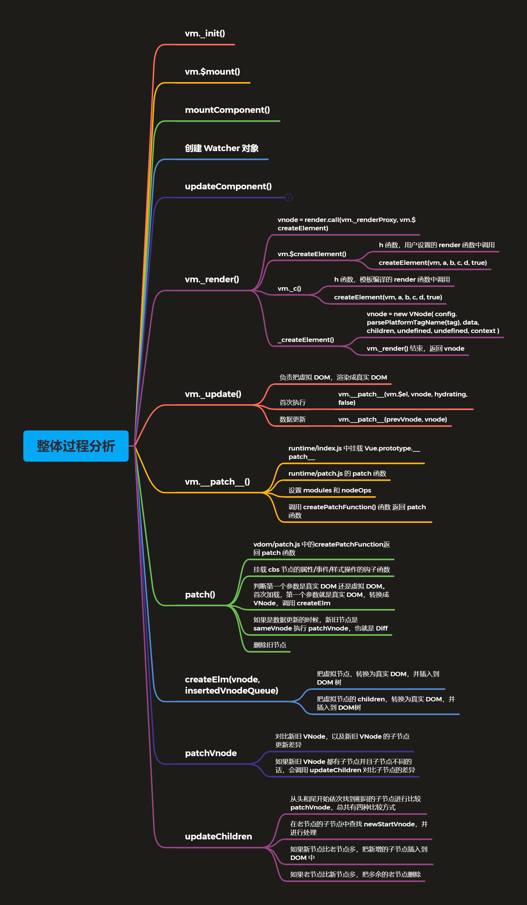

# Vue 源码剖析-虚拟 DOM

<!-- TOC -->

- [Vue 源码剖析-虚拟 DOM](#vue-源码剖析-虚拟-dom)
  - [虚拟 DOM 回顾](#虚拟-dom-回顾)
    - [什么是虚拟 DOM](#什么是虚拟-dom)
    - [为什么要使用虚拟 DOM](#为什么要使用虚拟-dom)
    - [Vue.js 中的虚拟 DOM](#vuejs-中的虚拟-dom)
  - [虚拟 DOM 创建过程](#虚拟-dom-创建过程)
    - [createElement](#createelement)
      - [功能](#功能)
      - [定义](#定义)
    - [update](#update)
      - [功能](#功能-1)
      - [定义](#定义-1)
    - [patch 函数初始化](#patch-函数初始化)
      - [功能](#功能-2)
      - [Snabbdom 中 patch 函数的初始化](#snabbdom-中-patch-函数的初始化)
      - [Vue.js 中 patch 函数的初始化](#vuejs-中-patch-函数的初始化)
    - [patch 函数执行过程](#patch-函数执行过程)
    - [createElm](#createelm)
    - [patchVnode](#patchvnode)
    - [updateChildren](#updatechildren)
    - [总结](#总结)

<!-- /TOC -->

## 虚拟 DOM 回顾

### 什么是虚拟 DOM

虚拟 DOM(Virtual DOM) 是使用 JavaScript 对象来描述 DOM，虚拟 DOM 的本质就是 JavaScript 对
象，使用 JavaScript 对象来描述 DOM 的结构。应用的各种状态变化首先作用于虚拟 DOM，最终映射
到 DOM。Vue.js 中的虚拟 DOM 借鉴了 Snabbdom，并添加了一些 Vue.js 中的特性，例如：指令和组
件机制。

Vue 1.x 中细粒度监测数据的变化，每一个属性对应一个 watcher，开销太大 Vue 2.x 中每个组件对应一
个 watcher，状态变化通知到组件，再引入虚拟 DOM 进行比对和渲染

### 为什么要使用虚拟 DOM

- 使用虚拟 DOM，可以避免用户直接操作 DOM，开发过程关注在业务代码的实现，不需要关注如何操作 DOM，从而提高开发效率
- 作为一个中间层可以跨平台，除了 Web 平台外，还支持 SSR、Weex。
- 关于性能方面，在首次渲染的时候肯定不如直接操作 DOM，因为要维护一层额外的虚拟 DOM，如果后续有频繁操作 DOM 的操作，这个时候可能会有性能的提升，虚拟 DOM 在更新真实 DOM 之前会通过 Diff 算法对比新旧两个虚拟 DOM 树的差异，最终把差异更新到真实 DOM

### Vue.js 中的虚拟 DOM

- 演示 render 中的 h 函数

  - h 函数就是 createElement()

  ```js
  const vm = new Vue({
      el: '#app',
      render (h) {
          // h(tag, data, children)
          // return h('h1', this.msg)
          // return h('h1', { domProps: { innerHTML: this.msg } })
          // return h('h1', { attrs: { id: 'title' }  }, this.msg)
          const vnode = h(
              'h1',
              {
                  attrs: { id: 'title'}
              },
              this.msg
          )
          console.log(vnode)
          return vnode
      }，
      data: {
          msg: 'Hello Vue'
      }
  })
  ```

## 虚拟 DOM 创建过程



### createElement

#### 功能

createElement()函数，用来创建虚拟节点(VNode)，我们的 render 函数中的参数 h，就是 createElement()

```js
render(h) {
	// 此处的 h 就是 vm.$createElement
	return h('h1', this.msg)
}
```

#### 定义

在 vm.\_render() 中调用了，用户传递的或者编译生成的 render 函数，这个时候传递了 createElement

- src/core/instance/render.js

```js
vm._c = (a, b, c, d) => createElement(vm, a, b, c, d, false);
// normalization is always applied for the public version, used in
// user-written render functions.
vm.$createElement = (a, b, c, d) => createElement(vm, a, b, c, d, true);
```

vm.c 和 vm.\$createElement 内部都调用了 createElement，不同的是最后一个参数。vm.c 在编译生成的 render 函数内部会调用，vm.\$createElement 在用户传入的 render 函数内部调用。当用户传入 render 函数的时候，要对用户传入的参数做处理

- src/core/vdom/create-element.js

执行完 createElement 之后创建好了 VNode，把创建好的 VNode 传递给 vm.\_update() 继续处理

```js
export function _createElement(
  context: Component,
  tag?: string | Class<Component> | Function | Object,
  data?: VNodeData,
  children?: any,
  normalizationType?: number
): VNode | Array<VNode> {
  if (isDef(data) && isDef((data: any).__ob__)) {
    process.env.NODE_ENV !== "production" &&
      warn(
        `Avoid using observed data object as vnode data: ${JSON.stringify(
          data
        )}\n` + "Always create fresh vnode data objects in each render!",
        context
      );
    return createEmptyVNode();
  }
  // object syntax in v-bind
  if (isDef(data) && isDef(data.is)) {
    tag = data.is;
  }
  if (!tag) {
    // in case of component :is set to falsy value
    return createEmptyVNode();
  }
  // warn against non-primitive key
  if (
    process.env.NODE_ENV !== "production" &&
    isDef(data) &&
    isDef(data.key) &&
    !isPrimitive(data.key)
  ) {
    if (!__WEEX__ || !("@binding" in data.key)) {
      warn(
        "Avoid using non-primitive value as key, " +
          "use string/number value instead.",
        context
      );
    }
  }
  // support single function children as default scoped slot
  if (Array.isArray(children) && typeof children[0] === "function") {
    data = data || {};
    data.scopedSlots = { default: children[0] };
    children.length = 0;
  }
  // 去处理 children
  if (normalizationType === ALWAYS_NORMALIZE) {
    // 当手写 render 函数的时候调用
    // 判断 children 的类型，如果是原始值的话转换成 VNode 的数组
    // 如果是数组的话，继续处理数组中的元素
    // 如果数组中的子元素又是数组(slot template)，递归处理
    // 如果连续两个节点都是字符串会合并文本节点
    children = normalizeChildren(children);
  } else if (normalizationType === SIMPLE_NORMALIZE) {
    // 把二维数组转换为一维数组
    // 如果 children 中有函数组件的话，函数组件会返回数组形式
    // 这时候 children 就是一个二维数组，只需要把二维数组转换为一维数组
    children = simpleNormalizeChildren(children);
  }
  let vnode, ns;
  // 判断 tag 是字符串还是组件
  if (typeof tag === "string") {
    let Ctor;
    ns = (context.$vnode && context.$vnode.ns) || config.getTagNamespace(tag);
    // 如果是浏览器的保留标签，创建对应的 VNode
    if (config.isReservedTag(tag)) {
      // platform built-in elements
      if (
        process.env.NODE_ENV !== "production" &&
        isDef(data) &&
        isDef(data.nativeOn)
      ) {
        warn(
          `The .native modifier for v-on is only valid on components but it was used on <${tag}>.`,
          context
        );
      }
      vnode = new VNode(
        config.parsePlatformTagName(tag),
        data,
        children,
        undefined,
        undefined,
        context
      );
    } else if (
      (!data || !data.pre) &&
      isDef((Ctor = resolveAsset(context.$options, "components", tag)))
    ) {
      // component
      // 否则的话创建组件
      vnode = createComponent(Ctor, data, context, children, tag);
    } else {
      // unknown or unlisted namespaced elements
      // check at runtime because it may get assigned a namespace when its
      // parent normalizes children
      vnode = new VNode(tag, data, children, undefined, undefined, context);
    }
  } else {
    // direct component options / constructor
    vnode = createComponent(tag, data, context, children);
  }
  if (Array.isArray(vnode)) {
    return vnode;
  } else if (isDef(vnode)) {
    if (isDef(ns)) applyNS(vnode, ns);
    if (isDef(data)) registerDeepBindings(data);
    return vnode;
  } else {
    return createEmptyVNode();
  }
}
```

### update

#### 功能

内部调用 vm.**patch**() 把虚拟 DOM 转换成真实 DOM

#### 定义

- src/core/instance/lifecycle.js

```js
Vue.prototype._update = function (vnode: VNode, hydrating?: boolean) {
  const vm: Component = this;
  const prevEl = vm.$el;
  const prevVnode = vm._vnode;
  const restoreActiveInstance = setActiveInstance(vm);
  vm._vnode = vnode;
  // Vue.prototype.__patch__ is injected in entry points
  // based on the rendering backend used.
  if (!prevVnode) {
    // initial render
    vm.$el = vm.__patch__(vm.$el, vnode, hydrating, false /* removeOnly */);
  } else {
    // updates
    vm.$el = vm.__patch__(prevVnode, vnode);
  }
  restoreActiveInstance();
  // update __vue__ reference
  if (prevEl) {
    prevEl.__vue__ = null;
  }
  if (vm.$el) {
    vm.$el.__vue__ = vm;
  }
  // if parent is an HOC, update its $el as well
  if (vm.$vnode && vm.$parent && vm.$vnode === vm.$parent._vnode) {
    vm.$parent.$el = vm.$el;
  }
  // updated hook is called by the scheduler to ensure that children are
  // updated in a parent's updated hook.
};
```

### patch 函数初始化

#### 功能

对比两个 VNode 的差异，把差异更新到真实 DOM。如果是首次渲染的话，会把真实 DOM 先转换成 VNode

#### Snabbdom 中 patch 函数的初始化

- src/snabbdom.ts

```js
export function init(modules: Array<Partial<Module>>, domApi?: DOMAPI) {
  return function patch(oldVnode: VNode | Element, vnode: VNode): VNode {};
}
```

- vnode

```js
export function vnode(
  sel: string | undefined,
  data: any | undefined,
  children: Array<VNode | string> | undefined,
  text: String | undefined,
  elm: Element | Text | undefined
): Vnode {
  const key = data === undefined ? undefined : data.key;
  return { sel, data, children, text, elm, key };
}
```

#### Vue.js 中 patch 函数的初始化

- src/platforms/web/runtime/index.js

```js
import { patch } from "./patch";

Vue.prototype._patch_ = inBrowser ? patch : noop;
```

- src/platforms/web/runtime/patch.js

```js
import * as nodeOps from "web/runtime/node-ops";
import { createPatchFunction } from "core/vdom/patch";
import baseModules from "core/vdom/modules/index";
import platformModules from "web/runtime/modules/index";

// the directive module should be applied last, after all
// built-in modules have been applied.
const modules = platformModules.concat(baseModules);

export const patch: Function = createPatchFunction({ nodeOps, modules });
```

- src/core/vdom/patch.js

```js
export function createPatchFunction(backend) {
  let i, j;
  const cbs = {};
  const { modules, nodeOps } = backend;
  // 把模块中的钩子函数全部设置到 cbs 中，将来统一触发
  // cbs --> { 'create': [fn1,fn2], ...}
  for (i = 0; i < hooks.length; ++i) {
    cbs[hooks[i]] = [];
    for (j = 0; j < modules.length; ++j) {
      if (isDef(modules[j][hooks[i]])) {
        cbs[hooks[i]].push(modules[j][hooks[i]]);
      }
    }
  }
  return function patch(oldVnode, vnode, hydrating, removeOnly) {};
}
```

### patch 函数执行过程

```js
function patch(oldVnode, vnode, hydrating, removeOnly) {
  // 如果没有 vnode 但是有 oldVnode，执行销毁的钩子函数
  if (isUndef(vnode)) {
    if (isDef(oldVnode)) invokeDestroyHook(oldVnode);
    return;
  }

  let isInitialPatch = false;
  const insertedVnodeQueue = [];

  if (isUndef(oldVnode)) {
    // 如果没有 oldVnode 创建 vnode 对应的真实 DOM
    // empty mount (likely as component), create new root element
    isInitialPatch = true;
    createElm(vnode, insertedVnodeQueue);
  } else {
    // 判断当前 oldVnode 是否是 DOM 元素（首次渲染）
    const isRealElement = isDef(oldVnode.nodeType);
    if (!isRealElement && sameVnode(oldVnode, vnode)) {
      // 如果不是真是 DOM，并且两个 VNode 是 sameVnode，这个时候开始执行 Diff
      // patch existing root node
      patchVnode(oldVnode, vnode, insertedVnodeQueue, null, null, removeOnly);
    } else {
      if (isRealElement) {
        // mounting to a real element
        // check if this is server-rendered content and if we can perform
        // a successful hydration.
        if (oldVnode.nodeType === 1 && oldVnode.hasAttribute(SSR_ATTR)) {
          oldVnode.removeAttribute(SSR_ATTR);
          hydrating = true;
        }
        if (isTrue(hydrating)) {
          if (hydrate(oldVnode, vnode, insertedVnodeQueue)) {
            invokeInsertHook(vnode, insertedVnodeQueue, true);
            return oldVnode;
          } else if (process.env.NODE_ENV !== "production") {
            warn(
              "The client-side rendered virtual DOM tree is not matching " +
                "server-rendered content. This is likely caused by incorrect " +
                "HTML markup, for example nesting block-level elements inside " +
                "<p>, or missing <tbody>. Bailing hydration and performing " +
                "full client-side render."
            );
          }
        }
        // either not server-rendered, or hydration failed.
        // create an empty node and replace it
        oldVnode = emptyNodeAt(oldVnode);
      }

      // replacing existing element
      const oldElm = oldVnode.elm;
      const parentElm = nodeOps.parentNode(oldElm);

      // create new node
      createElm(
        vnode,
        insertedVnodeQueue,
        // extremely rare edge case: do not insert if old element is in a
        // leaving transition. Only happens when combining transition +
        // keep-alive + HOCs. (#4590)
        oldElm._leaveCb ? null : parentElm,
        nodeOps.nextSibling(oldElm)
      );

      // update parent placeholder node element, recursively
      if (isDef(vnode.parent)) {
        let ancestor = vnode.parent;
        const patchable = isPatchable(vnode);
        while (ancestor) {
          for (let i = 0; i < cbs.destroy.length; ++i) {
            cbs.destroy[i](ancestor);
          }
          ancestor.elm = vnode.elm;
          if (patchable) {
            for (let i = 0; i < cbs.create.length; ++i) {
              cbs.create[i](emptyNode, ancestor);
            }
            // #6513
            // invoke insert hooks that may have been merged by create hooks.
            // e.g. for directives that uses the "inserted" hook.
            const insert = ancestor.data.hook.insert;
            if (insert.merged) {
              // start at index 1 to avoid re-invoking component mounted hook
              for (let i = 1; i < insert.fns.length; i++) {
                insert.fns[i]();
              }
            }
          } else {
            registerRef(ancestor);
          }
          ancestor = ancestor.parent;
        }
      }

      // destroy old node
      if (isDef(parentElm)) {
        removeVnodes([oldVnode], 0, 0);
      } else if (isDef(oldVnode.tag)) {
        invokeDestroyHook(oldVnode);
      }
    }
  }

  invokeInsertHook(vnode, insertedVnodeQueue, isInitialPatch);
  return vnode.elm;
}
```

### createElm

把 VNode 转换成真实 DOM，插入到 DOM 树上

```js
function createElm(
  vnode,
  insertedVnodeQueue,
  parentElm,
  refElm,
  nested,
  ownerArray,
  index
) {
  if (isDef(vnode.elm) && isDef(ownerArray)) {
    // This vnode was used in a previous render!
    // now it's used as a new node, overwriting its elm would cause
    // potential patch errors down the road when it's used as an insertion
    // reference node. Instead, we clone the node on-demand before creating
    // associated DOM element for it.
    vnode = ownerArray[index] = cloneVNode(vnode);
  }

  vnode.isRootInsert = !nested; // for transition enter check
  if (createComponent(vnode, insertedVnodeQueue, parentElm, refElm)) {
    return;
  }

  const data = vnode.data;
  const children = vnode.children;
  const tag = vnode.tag;
  if (isDef(tag)) {
    if (process.env.NODE_ENV !== "production") {
      if (data && data.pre) {
        creatingElmInVPre++;
      }
      if (isUnknownElement(vnode, creatingElmInVPre)) {
        warn(
          "Unknown custom element: <" +
            tag +
            "> - did you " +
            "register the component correctly? For recursive components, " +
            'make sure to provide the "name" option.',
          vnode.context
        );
      }
    }

    vnode.elm = vnode.ns
      ? nodeOps.createElementNS(vnode.ns, tag)
      : nodeOps.createElement(tag, vnode);
    setScope(vnode);

    /* istanbul ignore if */
    if (__WEEX__) {
      // in Weex, the default insertion order is parent-first.
      // List items can be optimized to use children-first insertion
      // with append="tree".
      const appendAsTree = isDef(data) && isTrue(data.appendAsTree);
      if (!appendAsTree) {
        if (isDef(data)) {
          invokeCreateHooks(vnode, insertedVnodeQueue);
        }
        insert(parentElm, vnode.elm, refElm);
      }
      createChildren(vnode, children, insertedVnodeQueue);
      if (appendAsTree) {
        if (isDef(data)) {
          invokeCreateHooks(vnode, insertedVnodeQueue);
        }
        insert(parentElm, vnode.elm, refElm);
      }
    } else {
      createChildren(vnode, children, insertedVnodeQueue);
      if (isDef(data)) {
        invokeCreateHooks(vnode, insertedVnodeQueue);
      }
      insert(parentElm, vnode.elm, refElm);
    }

    if (process.env.NODE_ENV !== "production" && data && data.pre) {
      creatingElmInVPre--;
    }
  } else if (isTrue(vnode.isComment)) {
    vnode.elm = nodeOps.createComment(vnode.text);
    insert(parentElm, vnode.elm, refElm);
  } else {
    vnode.elm = nodeOps.createTextNode(vnode.text);
    insert(parentElm, vnode.elm, refElm);
  }
}
```

### patchVnode

```js
function patchVnode(
  oldVnode,
  vnode,
  insertedVnodeQueue,
  ownerArray,
  index,
  removeOnly
) {
  // 如果新旧节点是完全相同的节点，直接返回
  if (oldVnode === vnode) {
    return;
  }

  if (isDef(vnode.elm) && isDef(ownerArray)) {
    // clone reused vnode
    vnode = ownerArray[index] = cloneVNode(vnode);
  }

  const elm = (vnode.elm = oldVnode.elm);

  if (isTrue(oldVnode.isAsyncPlaceholder)) {
    if (isDef(vnode.asyncFactory.resolved)) {
      hydrate(oldVnode.elm, vnode, insertedVnodeQueue);
    } else {
      vnode.isAsyncPlaceholder = true;
    }
    return;
  }

  // reuse element for static trees.
  // note we only do this if the vnode is cloned -
  // if the new node is not cloned it means the render functions have been
  // reset by the hot-reload-api and we need to do a proper re-render.
  if (
    isTrue(vnode.isStatic) &&
    isTrue(oldVnode.isStatic) &&
    vnode.key === oldVnode.key &&
    (isTrue(vnode.isCloned) || isTrue(vnode.isOnce))
  ) {
    vnode.componentInstance = oldVnode.componentInstance;
    return;
  }
  // 触发 prepatch 钩子函数
  let i;
  const data = vnode.data;
  if (isDef(data) && isDef((i = data.hook)) && isDef((i = i.prepatch))) {
    i(oldVnode, vnode);
  }
  // 获取新旧 VNode 的子节点
  const oldCh = oldVnode.children;
  const ch = vnode.children;
  // 触发 update 钩子函数
  if (isDef(data) && isPatchable(vnode)) {
    for (i = 0; i < cbs.update.length; ++i) cbs.update[i](oldVnode, vnode);
    if (isDef((i = data.hook)) && isDef((i = i.update))) i(oldVnode, vnode);
  }
  // 如果 vnode 没有 text 属性（说明有可能有子元素）
  if (isUndef(vnode.text)) {
    if (isDef(oldCh) && isDef(ch)) {
      // 如果新旧节点都有字节点并且不相同，这时候对比更新子节点
      if (oldCh !== ch)
        updateChildren(elm, oldCh, ch, insertedVnodeQueue, removeOnly);
    } else if (isDef(ch)) {
      if (process.env.NODE_ENV !== "production") {
        checkDuplicateKeys(ch);
      }
      // 如果新节点有子节点，并且旧节点有 text
      // 清空就节点对应的真实 DOM 的文本内容
      if (isDef(oldVnode.text)) nodeOps.setTextContent(elm, "");
      // 把新节点的子节点转换成真实 DOM ，添加到 elm
      addVnodes(elm, null, ch, 0, ch.length - 1, insertedVnodeQueue);
    } else if (isDef(oldCh)) {
      // 如果旧节点有子节点，并且旧节点有 text
      // 移除所有旧节点对应的真实 DOM
      removeVnodes(oldCh, 0, oldCh.length - 1);
    } else if (isDef(oldVnode.text)) {
      // 如果旧节点有 text，新节点没有子节点和 text
      nodeOps.setTextContent(elm, "");
    }
  } else if (oldVnode.text !== vnode.text) {
    // 如果新节点有 text，并且和旧节点的 text 不同
    // 直接把新节点的 text 更新到 DOM 上
    nodeOps.setTextContent(elm, vnode.text);
  }
  // 触发 postpatch 钩子函数
  if (isDef(data)) {
    if (isDef((i = data.hook)) && isDef((i = i.postpatch))) i(oldVnode, vnode);
  }
}
```

### updateChildren

updateChildren 和 Snabbdom 中的 updateChildren 整体算法一致，这里就不再展开了。我们再来看下它处理过程中 key 的作用，再 patch 函数中，调用 patchVnode 之前，会首先调用 sameVnode() 判断当前的新老 VNode 是否是相同节点，sameVnode() 中会首先判断 key 是否相同。

- 通过下面代码来体会 key 的作用

```html
<div id="app">
  <button @click="handler">按钮</button>
  <ul>
    <li v-for="value in arr">{{value}}</li>
  </ul>
</div>

<script src="../../dist/vue.js"></script>
<script>
  const vm = new Vue({
    el: "#app",
    data: {
      arr: ["a", "b", "c", "d"],
    },
    methods: {
      handler() {
        this.arr = ["a", "x", "b", "c", "d"];
      },
    },
  });
</script>
```

- 当没有设置 key 时

在 updateChildren 中比较子节点的时候，会做三次更新 DOM 操作和一次插入 DOM 的操作

- 当设置 key 时

在 upateChildren 中比较子节点的时候，因为 oldVnode 的子节点的 b,c,d 和 newVnode 的 x,b,c 的 key 相同，所以只做比较，没有更新 DOM 的操作，当遍历完毕后，会再把 x 插入到 DOM 上 DOM 操作只有一次插入操作

### 总结


